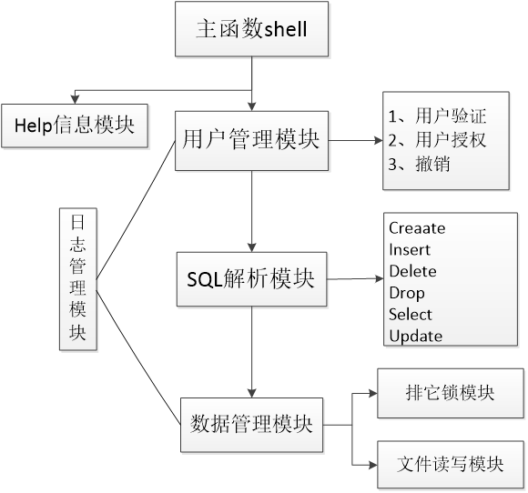

# DBMS_qwk
## ———— 自己写一个数据库管理系统
《数据库原理》课程设计：C/C++写一个数据库管理系统。  
（由于时间紧迫，代码结构有些乱） 

## 开发环境
codeblocks-13.12  +  windows7  

## 实现功能 
1. 设计特定的数据结构，用于存储数据表、视图、索引等数据库对象的信息；
2. 设计特定的数据结构，分别用于存储用户和访问权限的信息；
3. 输入“help database”命令，输出所有数据表、视图和索引的信息，同时显示其对象类型；输入“help table 表名”命令，输出数据表中所有属性的详细信息；输入“help view 视图名”命令，输出视图的定义语句；输入“help index 索引名”命令，输出索引的详细信息；0.6
4. 解析CREATE、SELECT、INSERT、DELETE、UPDATE等SQL语句的内容；
5. 检查SQL语句中的语法错误和语义错误；
6. 执行CREATE语句，创建数据表、视图、索引等数据库对象；创建数据表时需要包含主码、外码、唯一性约束、非空约束等完整性约束的定义；
7. 执行SELECT语句，从自主设计的数据表中查询数据，并输出结果；在SELECT语句中需要支持GROUP BY、HAVING和ORDER BY子句，需要支持5种聚集函数；
8. 执行INSERT、DELETE和UPDATE语句，更新数据表的内容；更新过程中需要检查更新后的数据表是否会违反参照完整性约束。如果是，则提示违反哪一条完整性约束，并拒绝执行更新操作；如果否，提示数据表更新成功，并说明插入、删除或修改了几个元组。
9. 执行GRANT语句，为用户授予SELECT、INSERT、DELETE、UPDATE权限；执行REVOKE语句，收回上述权限；
10. 用户登录时，需要输入用户名；如果用户没有被授权，则拒绝执行用户查询或更新操作，并给出提示信息；
11. 系统日志的简单记录；
12. “排它锁”的简单尝试；

## 模块架构

## 实现 SQL
- help语句  
help database  
help table  
help view  
help index  

- SQL语句  
create table students(Sno char,Sname char,Sage int);  
insert into students value(01,qwk,18);  
create index students on students(Sno,Sage);  
create view stuv as select * from students;  
update students set Sage=22 where Sno=01;  
select Sno,Sname from students where Sno=01 and Sage=18;  
select Sno,Sage from students where Sno<02 and Sage=18;  
select * from students  
drop index Stu  
drop view stuv  
drop table students  
delete from students where Sno=01  
grant select on table students to a  
revoke select on table students from a  